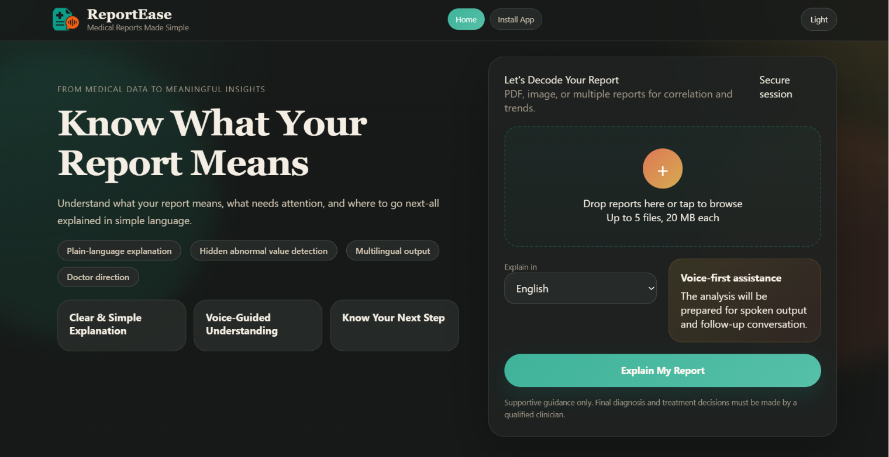
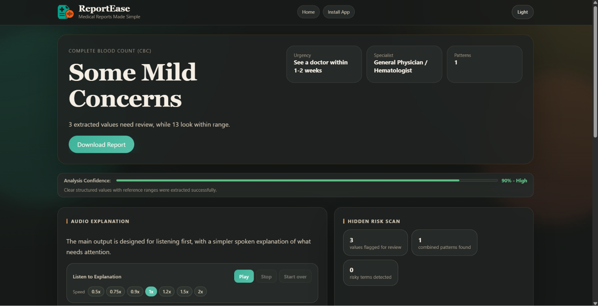
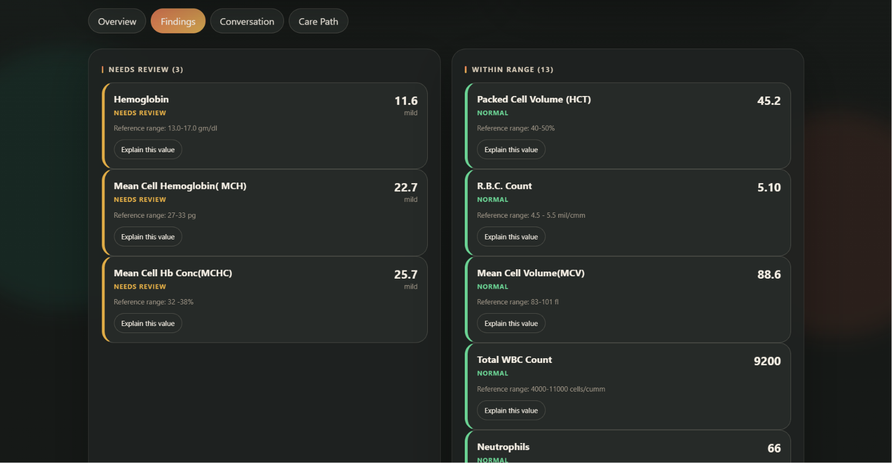
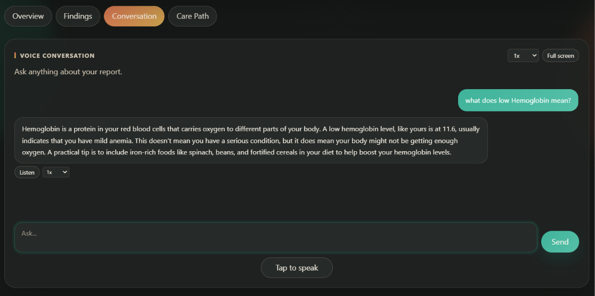

<p align="center">
  
</p>

<h1 align="center">ReportEase</h1>

<p align="center">
  <b>AI-Powered Medical Report Explanation Assistant</b>
</p>

<p align="center">
  From medical data to meaningful insights — explained simply, spoken clearly, and supported in multiple languages.
</p>

<p align="center">
  
  
  
  
</p>

---

## 📌 What Is ReportEase?

ReportEase is an AI-powered medical report explanation assistant that helps users understand medical reports in simple language.

Users can upload a lab report, blood test, scan report, or medical document. ReportEase extracts the content, explains the findings clearly, highlights values that may need attention, suggests suitable next steps, and supports voice-based interaction.

It is designed for people who find medical reports difficult to understand because of complex terms, abbreviations, reference ranges, and clinical language.

> ⚠️ ReportEase is an informational and educational support tool. It does not provide medical diagnosis or treatment. Always consult a qualified medical professional for medical decisions.


### Home Page


---

## 💡 Why This Project Matters

Medical reports can be confusing for many users. Even when a report contains important values, people may not understand what those values mean or what they should do next.

ReportEase helps make medical information:

| Goal           | How ReportEase Helps                                |
| -------------- | --------------------------------------------------- |
| Understandable | Explains report findings in simple language         |
| Accessible     | Supports voice output and multilingual explanations |
| Actionable     | Suggests specialist direction and next steps        |
| Inclusive      | Helps users who prefer listening over reading       |
| Safer          | Highlights values that may need attention           |

---

## ✨ Key Features

| Feature                     | Description                                                                     |
| --------------------------- | ------------------------------------------------------------------------------- |
| 🔬 Report Analysis          | Upload medical reports and get a simple explanation of findings                 |
| 🧠 Hidden Concern Detection | Detects borderline or abnormal values even when the report summary looks normal |
| 🎧 Voice-Guided Output      | Reads explanations aloud for easier understanding                               |
| 🎤 Voice Input              | Allows users to ask follow-up questions by speaking                             |
| 💬 AI Follow-Up Chat        | Users can continue asking questions based on their uploaded report              |
| 🌐 Multilingual Support     | Supports multiple languages, including major Indian languages                   |
| 🧭 Next-Step Guidance       | Suggests urgency level, possible specialist, and safety-focused actions         |
| 🏥 Nearby Hospital Search   | Helps users find nearby hospitals or clinics based on location                  |

---

## 🔬 Report Analysis

ReportEase supports medical report understanding by extracting and analysing report content.

| Supported Input | Details                                                                                             |
| --------------- | --------------------------------------------------------------------------------------------------- |
| PDF reports     | Digital medical reports and lab reports                                                             |
| Image reports   | JPG, PNG, WebP, BMP and similar image formats                                                       |
| Report types    | Blood tests, CBC, thyroid, diabetes, liver, kidney, lipid profile, radiology text reports, and more |
| Output          | Simple explanation, findings, concern level, and next-step suggestions                              |

### Report Analysis


---

## 📊 Parameter Findings

For extracted medical values, ReportEase can show:

| Field              | Meaning                                |
| ------------------ | -------------------------------------- |
| Parameter Name     | Name of the test or medical value      |
| Current Value      | Value extracted from the report        |
| Reference Range    | Expected or normal range, if available |
| Status             | Normal, borderline, or needs attention |
| Explanation        | Simple meaning of the value            |
| Possible Relevance | Why the value may matter               |


### Parameter Findings



---

## 🧠 Hidden Concern Detection

ReportEase does not depend only on the report’s final summary. It checks individual parameters and looks for values that may be:

| Status          | Meaning                                              |
| --------------- | ---------------------------------------------------- |
| Normal          | Value appears within expected range                  |
| Borderline      | Value is close to the limit and may need observation |
| Needs Attention | Value appears outside the expected range             |
| Unclear         | More context or doctor review may be needed          |

This helps users notice mild or hidden concerns that may otherwise be missed.

---

## 🧭 What To Do Next

After analysis, ReportEase provides practical next-step guidance.

| Guidance Type        | Example                                                              |
| -------------------- | -------------------------------------------------------------------- |
| Urgency Level        | Routine, see a doctor soon, or urgent                                |
| Specialist Direction | General physician, endocrinologist, cardiologist, hematologist, etc. |
| Doctor Questions     | Helpful questions the user can ask during consultation               |
| Safe Suggestions     | General care suggestions such as hydration, rest, or diet awareness  |
| Caution              | Reminds users to confirm results with a qualified doctor             |

---

## 🏥 Nearby Hospital Support

ReportEase can help users search for nearby hospitals and clinics.

| Capability              | Description                                                     |
| ----------------------- | --------------------------------------------------------------- |
| Location Search         | Uses city or location access                                    |
| Specialist-Based Search | Searches based on suggested specialist needs                    |
| Hospital Details        | Name, address, and map-related information where available      |
| Maps Support            | Helps users move from report understanding to real-world action |

---

## 🎧 Voice Audio Output

Voice support is a core part of ReportEase.

| Feature               | Description                                              |
| --------------------- | -------------------------------------------------------- |
| Audio Explanation     | Converts report explanation into speech                  |
| Language Support      | Speaks in the selected language where supported          |
| Playback Controls     | Play, stop, reset, and speed control                     |
| Chat Audio            | AI follow-up replies can also be spoken aloud            |
| Accessibility Benefit | Useful for users who prefer listening instead of reading |

---

## 🎤 Voice Input

Users can ask questions by speaking instead of typing.

| Feature                 | Description                                                |
| ----------------------- | ---------------------------------------------------------- |
| Speech-to-Text          | Converts spoken questions into text                        |
| Follow-Up Questions     | Users can ask about symptoms, values, or next steps        |
| Browser-Based Recording | Uses browser microphone support                            |
| AI Response             | The assistant replies based on the uploaded report context |

---

## 💬 Interactive AI Chat

The chat feature allows users to continue the conversation after the report is analysed.

| Chat Capability         | Description                                       |
| ----------------------- | ------------------------------------------------- |
| Report-Aware Replies    | Answers are based on the uploaded report          |
| Text or Voice Questions | Users can type or speak                           |
| Simple Explanations     | Avoids unnecessary medical complexity             |
| Multilingual Replies    | Responds in the selected language where supported |
| Session Context         | Maintains report context during the session       |

### AI Follow-Up Chat


---

## 🌐 Language Support

ReportEase is designed with multilingual accessibility in mind.

| Region                             | Example Languages                                                             |
| ---------------------------------- | ----------------------------------------------------------------------------- |
| Indian Languages                   | Tamil, Hindi, Malayalam, Telugu, Kannada, Bengali, Marathi, Gujarati, Punjabi |
| Global Languages                   | English, Spanish, French, German, Italian, Portuguese                         |
| Asian Languages                    | Japanese, Chinese, Korean, Indonesian, Malay                                  |
| Middle Eastern & African Languages | Arabic, Swahili, Hausa and more where supported                               |

The goal is to explain medical information in the user’s preferred language, not only in English.

---

### Demo
[▶️ Watch Demo Video](assets/Demo-ReportEase.mp4)

---

## 🛠️ Tech Stack

| Layer        | Technology               | Purpose                                         |
| ------------ | ------------------------ | ----------------------------------------------- |
| Frontend     | React                    | User interface                                  |
| Routing      | React Router             | Page navigation                                 |
| HTTP Client  | Axios                    | API communication                               |
| UI Animation | Framer Motion            | Smooth interface animations                     |
| Styling      | CSS                      | Responsive layout and visual design             |
| Backend      | FastAPI                  | REST API server                                 |
| Server       | Uvicorn                  | Runs the FastAPI app                            |
| Validation   | Pydantic                 | Request and response validation                 |
| PDF Handling | PyPDF2                   | Extracts text from PDF reports                  |
| AI Provider  | Groq API                 | OCR, analysis, chat, and speech-to-text support |
| Maps Data    | OpenStreetMap / Overpass | Nearby hospital and clinic search               |
| Deployment   | Render + Vercel          | Backend and frontend hosting                    |

---

## 🤖 AI and Voice Models

| Model / Service   | Purpose                                       |
| ----------------- | --------------------------------------------- |
| Groq Vision Model | Reads report images and supports OCR          |
| Groq LLM          | Analyses report content and explains findings |
| Groq Chat Model   | Handles follow-up questions                   |
| Whisper-Based STT | Converts user speech into text                |
| TTS Support       | Converts explanations and replies into audio  |

---

## 📁 Project Structure

```text
reportease/
│
├── backend/
│   ├── main.py
│   ├── config.py
│   ├── models.py
│   ├── requirements.txt
│   ├── .env.example
│   └── services/
│       ├── ocr.py
│       ├── analysis.py
│       ├── chat.py
│       ├── hospitals.py
│       ├── stt.py
│       ├── tts.py
│       └── ui_translate.py
│
├── frontend/
│   ├── package.json
│   ├── package-lock.json
│   ├── public/
│   │   └── icon-512.png
│   └── src/
│       ├── App.jsx
│       ├── components/
│       ├── pages/
│       ├── context/
│       ├── hooks/
│       └── utils/
│
├── .gitignore
├── render.yaml
├── Procfile
└── README.md
```

---

## 🚀 Setup and Installation

### Prerequisites

| Requirement  | Recommended Version      |
| ------------ | ------------------------ |
| Python       | 3.10+                    |
| Node.js      | 18+                      |
| npm          | Latest stable            |
| Git          | Latest stable            |
| Groq API Key | Required for AI features |

---

## ⚙️ Backend Setup

Open the terminal in the project root:

```bash
cd backend
```

Install backend dependencies:

```bash
py -m pip install -r requirements.txt
```

Create the environment file:

```bash
copy .env.example .env
```

Add your Groq API key inside `backend/.env`:

```env
GROQ_API_KEY=your_groq_api_key_here
```

Run the backend:

```bash
py -m uvicorn main:app --reload
```

Backend will run at:

```text
http://127.0.0.1:8000
```

Health check:

```text
http://127.0.0.1:8000/health
```

---

## 🖥️ Frontend Setup

Open another terminal and go to the frontend folder:

```bash
cd frontend
```

Install frontend dependencies:

```bash
npm install
```

Start the frontend:

```bash
npm start
```

Frontend will run at:

```text
http://localhost:3000
```

---

## 🔐 Environment Variables

### Backend

Create `backend/.env`:

```env
GROQ_API_KEY=your_groq_api_key_here
```

### Frontend

For local development, create `frontend/.env` if needed:

```env
REACT_APP_API_URL=http://127.0.0.1:8000
```

For production deployment:

```env
REACT_APP_API_URL=https://your-backend-url.onrender.com
```

---

## 📡 API Endpoints

| Method   | Endpoint                 | Description                         |
| -------- | ------------------------ | ----------------------------------- |
| `GET`    | `/health`                | Checks backend status               |
| `POST`   | `/api/ocr`               | Extracts text from uploaded reports |
| `POST`   | `/api/analyze`           | Analyses report content             |
| `POST`   | `/api/chat`              | Handles follow-up questions         |
| `GET`    | `/api/chat/history/{id}` | Gets chat history for a session     |
| `POST`   | `/api/hospitals`         | Finds nearby hospitals or clinics   |
| `POST`   | `/api/tts`               | Converts text to speech             |
| `POST`   | `/api/stt`               | Converts speech to text             |
| `DELETE` | `/api/session/{id}`      | Clears session data                 |

---

## 🔁 How It Works

```text
User uploads report
        ↓
Backend extracts report text
        ↓
AI analyses values and findings
        ↓
Hidden or borderline concerns are detected
        ↓
Simple explanation is generated
        ↓
Frontend shows summary, findings, next steps, and hospital support
        ↓
Voice output reads the explanation
        ↓
User asks follow-up questions by text or voice
```

---

## 🌍 Deployment

The project is prepared for deployment using GitHub, Render, and Vercel.

| Part                  | Platform                     |
| --------------------- | ---------------------------- |
| Source Code           | GitHub                       |
| Backend               | Render                       |
| Frontend              | Vercel                       |
| Environment Variables | Render and Vercel dashboards |

Recommended deployment flow:

```text
Push project to GitHub
        ↓
Deploy backend on Render
        ↓
Add backend URL to frontend environment variables
        ↓
Deploy frontend on Vercel
        ↓
Update README with live project link
        ↓
Create installer after final deployed URLs are ready
```

---

## 🧪 Testing Before Deployment

### Frontend Build

```bash
cd frontend
npm install
npm run build
```

Expected result:

```text
Compiled successfully.
```

### Backend Health Check

```bash
cd backend
py -m uvicorn main:app --reload
```

Then open:

```text
http://127.0.0.1:8000/health
```

Expected response:

```json
{
  "status": "ok",
  "version": "2.1.0"
}
```

---

## 🛡️ Security Notes

| Security Point    | Status                                        |
| ----------------- | --------------------------------------------- |
| `.env` files      | Should never be committed                     |
| API keys          | Must be kept private                          |
| `.env.example`    | Safe to commit if it contains no real secrets |
| Medical reports   | Should be handled carefully as sensitive data |
| Permanent storage | Not intended for uploaded reports             |
| User safety       | Medical disclaimer must always be shown       |

---

## ⚠️ Medical Disclaimer

ReportEase is built to make medical reports easier to understand, but it is not a replacement for professional medical advice.

It does not:

* Diagnose medical conditions
* Prescribe medicines
* Replace a doctor
* Confirm or rule out disease
* Handle medical emergencies

For emergencies such as chest pain, breathing difficulty, fainting, severe weakness, or serious symptoms, contact emergency medical services immediately.

---

## 📄 License

This project is open for learning, improvement, and responsible use.

---

## 👩‍💻 Developer

Built by **Kavya S**

Created with the goal of making medical report understanding simpler, more accessible, and more inclusive.
